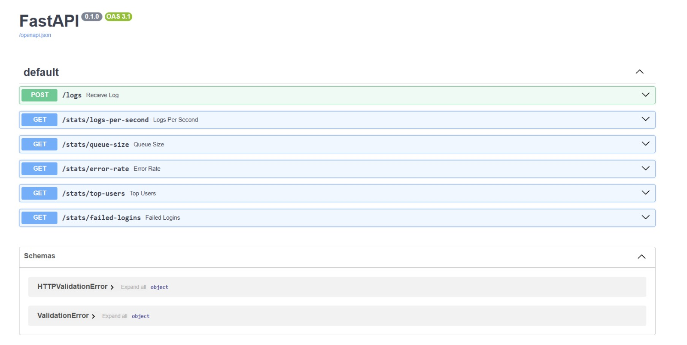

# Log Ingestion & Analytics Engine

A high-throughput backend log ingestion and analytics system built in Python using FastAPI, PostgreSQL, queue-based buffering, batching, threaded background workers, retries, analytics queries, and Docker.

This project was built to explore backend systems engineering concepts such as concurrent ingestion, queue-based buffering, batching, background processing, database write optimization, retry handling, observability infrastructure, analytics, and containerized deployment.

---

## Architecture


---

## System Flow

```text
Log Sender
    ↓
FastAPI API
    ↓
Shared In-Memory Queue
    ↓
Background Worker Thread
    ↓
Batch Processing
    ↓
PostgreSQL Database
    ↓
Analytics Queries
    ↓
Analytics REST API
```

The engine separates log ingestion from database persistence through an in-memory queue and background worker.

This allows incoming logs to be accepted independently of the timing of PostgreSQL batch writes.

---

## Features

- FastAPI-based ingestion API
- Structured log ingestion
- Queue-based buffering architecture
- Thread-safe shared in-memory queue
- Threaded background worker processing
- Batch PostgreSQL inserts
- Retry handling for failed database writes
- Failed-log handling
- Analytics and monitoring endpoints
- Percentile-based latency analytics
- Endpoint-level performance analytics
- HTTP error-rate analytics
- Cursor-based pagination for large query results
- SafeStep observability integration
- Request correlation IDs
- AI-provider analytics
- AI fallback analytics
- Dockerized deployment
- Environment-variable based configuration
- Modular layered backend architecture

---

## Tech Stack

- Python
- FastAPI
- PostgreSQL
- SQL
- Docker
- Threading
- REST APIs
- Pydantic
- psycopg2
- Object-Oriented Programming (OOP)

---

## Performance Benchmarks

| Benchmark | Throughput |
|---|---:|
| Single `requests.post()` | 46.63 logs/sec |
| Single-thread `requests.Session()` | 246.29 logs/sec |
| 4-thread concurrent sender | 921.43 logs/sec |

### Key Findings

- Reusing HTTP connections significantly reduced request overhead.
- Concurrent request generation increased throughput substantially.
- The final implementation achieved approximately 20x higher throughput compared to the baseline implementation.

These measurements evaluate the log ingestion pipeline itself.

For detailed benchmark methodology and results, see:

`benchmark_results.md`

---

## SafeStep Observability Integration

The Log Analytics Engine is integrated with SafeStep as a structured backend observability service.

SafeStep sends application telemetry to the engine, which queues, batches, persists, and analyzes the telemetry using PostgreSQL.

### Integration Architecture

```text
SafeStep API
      │
      │ POST /logs/structured
      ▼
Structured Log Ingestion
      │
      ▼
Shared In-Memory Queue
      │
      ▼
Background Worker
      │
      ▼
Batch PostgreSQL Insert
      │
      ▼
valid_logs
      │
      ▼
AnalyticsService
      │
      ▼
PostgreSQL Analytics Queries
      │
      ▼
SafeStep Analytics REST API
```

### Structured Telemetry

SafeStep uses the following structured ingestion endpoint:

`POST /logs/structured`

Telemetry fields include:

- `timestamp`
- `level`
- `service`
- `user_id`
- `action`
- `status`
- `ip`
- `route`
- `method`
- `duration_ms`
- `request_id`
- `deployment`

The `valid_logs` PostgreSQL table was extended with:

- `route`
- `method`
- `duration_ms`
- `request_id`
- `deployment`

These fields allow the engine to perform application-performance analysis instead of treating the telemetry as unstructured log text.

### Queue-Based Ingestion

Structured telemetry is converted into `LogData` objects and placed into the shared in-memory queue.

The ingestion path is decoupled from PostgreSQL writes:

```text
HTTP ingestion
      ↓
Shared Queue
      ↓
Background Worker
      ↓
Batch
      ↓
PostgreSQL
```

If the queue reaches capacity, the structured ingestion endpoint returns:

```text
HTTP 503
Queue Full
```

rather than silently accepting telemetry that cannot be queued.

### Request Correlation

SafeStep generates a request ID in its HTTP middleware and propagates it through the analysis workflow.

This allows multiple events from the same request to be correlated:

```text
request_completed
      │
      ├── ai_openai_completed
      │
      ├── ai_analysis_completed
      │
      └── analysis_completed
```

A single request can therefore be investigated across:

```text
HTTP layer
    ↓
Analysis service
    ↓
AI orchestrator
    ↓
AI provider
    ↓
Analysis completion
```

### Route Normalization

Dynamic SafeStep routes are recorded using FastAPI route templates.

For example:

`/analyses/{upload_id}`

instead of creating a separate analytics endpoint for every analysis UUID.

CORS OPTIONS requests are excluded from application request analytics.

---

## SafeStep Analytics

The Log Analytics Engine exposes dedicated SafeStep analytics endpoints.

### Request Latency

`GET /stats/safestep/request-latency`

Returns request latency percentiles:

- sample count
- p50
- p95
- p99

### Analysis Latency

`GET /stats/safestep/analysis-latency`

Measures end-to-end SafeStep analysis latency.

### AI Latency

`GET /stats/safestep/ai-latency`

Measures the duration of the AI analysis workflow.

### Endpoint Latency

`GET /stats/safestep/endpoints`

Returns latency statistics grouped by normalized API route.

### HTTP Errors

`GET /stats/safestep/errors`

Reports:

- total requests
- 4xx errors
- 5xx errors
- 4xx rate
- 5xx rate

Both completed requests and failed-request telemetry are included in the error calculation.

### Analysis Reliability

`GET /stats/safestep/analysis`

Reports:

- successful analyses
- failed analyses
- total analyses
- success rate
- failure rate

### AI Provider Analytics

`GET /stats/safestep/ai-providers`

Reports OpenAI and NVIDIA provider events including:

- completed requests
- failed requests
- average latency
- p50
- p95
- p99

### AI Fallback Rate

`GET /stats/safestep/fallback`

Reports:

- total analyses
- fallback events
- fallback percentage

### Analytics Time Window

Each SafeStep analytics endpoint accepts a configurable time window:

`?hours=N`

Examples:

```text
/stats/safestep/request-latency?hours=24
/stats/safestep/errors?hours=24
/stats/safestep/ai-providers?hours=24
```

---

## SafeStep Local Validation

The SafeStep integration was validated locally by sending real SafeStep application telemetry through the Log Analytics Engine and querying the resulting PostgreSQL records.

These measurements are local-development validation results and are not production performance claims.

### Request Latency

One local 24-hour validation snapshot contained:

```text
Samples: 18
p50:      3.59 ms
p95:   2766.17 ms
p99:   8121.90 ms
```

### Analysis Latency

One measured analysis produced:

```text
Samples: 1
p50:   8714.81 ms
p95:   8714.81 ms
p99:   8714.81 ms
```

### AI Latency

The corresponding AI workflow measured:

```text
Samples: 1
p50:   7603.64 ms
p95:   7603.64 ms
p99:   7603.64 ms
```

One observed analysis showed AI processing accounting for approximately 87% of the total analysis duration.

Later local observations included approximately:

```text
OpenAI / AI latency: 9.28–11.06 seconds
Analysis workflow:   11.50–13.48 seconds
HTTP request:        13.45–15.43 seconds
```

These are individual local observations rather than representative percentile measurements.

### Analysis Reliability

A local validation window recorded:

```text
Successful analyses: 4
Failed analyses:     0
Success rate:        100%
```

### AI Fallback

The same validation window recorded:

```text
Analyses:          4
NVIDIA fallbacks:  0
Fallback rate:     0%
```

### Error Validation

A real local unauthorized upload request produced:

```text
HTTP 401
POST /uploads
```

A controlled local server-error test produced:

```text
HTTP 500
action = request_failed
```

The 500 event was successfully persisted in PostgreSQL and included in the server-error analytics.

The resulting local validation snapshot showed:

```text
Total requests:   21
Server errors:     1
Client errors:     1
5xx rate:          4.76%
4xx rate:          4.76%
```

This was a controlled local validation dataset and should not be interpreted as production reliability data.

---

## API Endpoints

### Ingestion

#### `POST /logs`

Accepts traditional log events and enqueues them for background processing.

Example payload:

```json
{
  "timestamp": "2026-05-23T12:00:00",
  "level": "INFO",
  "service": "auth-service",
  "user_id": 42,
  "action": "login",
  "status": 200,
  "ip": "127.0.0.1"
}
```

#### `POST /logs/structured`

Accepts structured telemetry for modern application integrations such as SafeStep.

Example payload:

```json
{
  "timestamp": "2026-09-27T03:34:00Z",
  "level": "INFO",
  "service": "safestep-api",
  "user_id": null,
  "action": "analysis_completed",
  "status": 200,
  "ip": "127.0.0.1",
  "route": "/analyses/{upload_id}",
  "method": "POST",
  "duration_ms": 11501.60,
  "request_id": "example-request-id",
  "deployment": "local"
}
```

### Analytics Endpoints

| Endpoint | Description |
|---|---|
| `GET /stats/logs-per-second` | Returns ingestion throughput metrics. |
| `GET /stats/queue-size` | Returns current queue size. |
| `GET /stats/error-rate` | Returns system error rate metrics. |
| `GET /stats/top-users` | Returns top users based on log activity with filtering and pagination support. |
| `GET /stats/failed-logins` | Returns failed login statistics. |

---

## Project Structure

```text
log-engine/
│
├── api/
├── analytics/
├── ingestion/
├── models/
├── parser/
├── storage/
├── assets/
├── sample_data/
│
├── app.py
├── main.py
├── requirements.txt
├── Dockerfile
├── README.md
└── benchmark_results.md
```

---

## Running The Project

### 1. Install Dependencies

```bash
pip install -r requirements.txt
```

### 2. Configure Environment Variables

Create a `.env` file:

```env
DB_NAME=log_engine
DB_USER=postgres
DB_PASSWORD=<your_password>
DB_HOST=localhost
DB_PORT=5432
```

### 3. Start FastAPI Server

For standalone local development:

```bash
python -m uvicorn api.server:app --reload
```

The default local API is available at:

`http://127.0.0.1:8000`

For local SafeStep integration, the Log Analytics Engine was run on port 8001 so it could operate alongside the SafeStep backend on port 8000:

```bash
python -m uvicorn api.server:app --reload --port 8001
```

### 4. Start Synthetic Traffic Generator

```bash
python -m ingestion.sender
```

After starting the FastAPI server, open:

`http://127.0.0.1:8000/docs`

For the SafeStep integration setup:

`http://127.0.0.1:8001/docs`

<p align="center">
  
</p>

This launches the interactive Swagger UI where you can:

- Test ingestion endpoints
- Query analytics endpoints
- Inspect request/response schemas
- Explore API functionality directly from the browser

---

## Docker Deployment

Build the Docker image:

```bash
docker build -t log-engine .
```

Run the container:

```bash
docker run -p 8000:8000 \
  -e DB_HOST=host.docker.internal \
  log-engine
```

The container overrides the database host while keeping all other configuration values unchanged.

Open:

`http://localhost:8000/docs`

to access the API documentation.

### Note

The application reads database configuration from environment variables.

For local development:

```env
DB_HOST=localhost
```

For Docker deployments using a local PostgreSQL instance:

```env
DB_HOST=host.docker.internal
```

---

## Sample Analytics Response

```json
{
  "logs_per_second": 142,
  "queue_size": 18,
  "error_rate": 0.03
}
```

### Example Analytics Endpoints

```text
GET /stats/logs-per-second
GET /stats/queue-size
GET /stats/error-rate
GET /stats/top-users
GET /stats/failed-logins
```

Example:

`http://127.0.0.1:8000/stats/top-users`

---

## Key Concepts Explored

- Backend ingestion pipelines
- Queue-based architectures
- Multithreaded worker systems
- Shared-memory concurrency
- Batch database processing
- Retry handling strategies
- Analytics query optimization
- Percentile latency analysis
- Structured telemetry
- Request correlation
- AI-provider observability
- Error-rate analytics
- API design and validation
- Docker containerization
- Environment-based configuration

---

## Future Improvements

- Redis/Kafka integration
- Load and stress testing at larger scales
- Monitoring dashboards
- Multiple worker scaling
- Distributed ingestion architecture
- Production observability deployment
- Larger-scale production telemetry analysis

---

## Measurement Notes

The SafeStep telemetry measurements documented in this README were collected during local development.

They are intended to validate:

- structured log ingestion
- queue-based processing
- PostgreSQL persistence
- percentile analytics
- endpoint aggregation
- request correlation
- error analytics
- AI-provider analytics
- fallback analytics

They should not be interpreted as production-scale performance or reliability measurements.

Future production benchmark entries should record:

- date
- environment
- sample count
- measurement window
- metric
- methodology
- measured result
- limitations

Historical benchmark results should be preserved rather than overwritten.

For the detailed benchmark history, see:

`benchmark_results.md`

---

## Learning Goals

This project was built as a hands-on way to learn backend systems engineering by designing and implementing infrastructure-focused systems from scratch rather than relying solely on tutorials or simple CRUD applications.

The project is intended to provide practical experience with:

- backend API design
- concurrent ingestion
- queues and background workers
- batch processing
- PostgreSQL persistence
- analytics query design
- failure handling
- observability
- Docker
- system performance measurement
- integration between independent backend services
