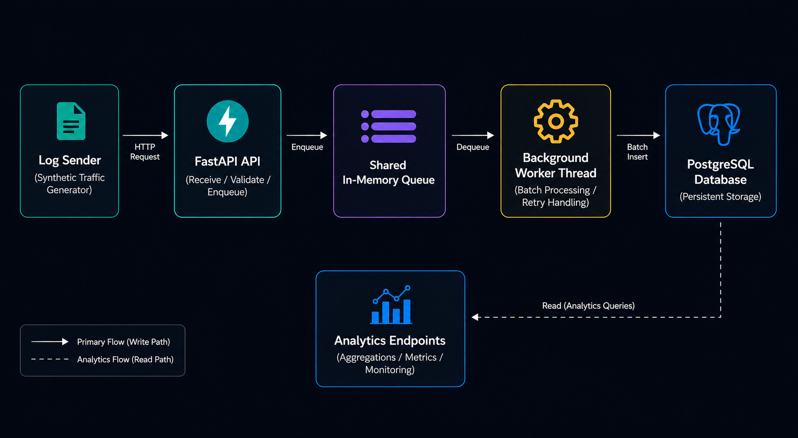

# Log Ingestion & Analytics Engine

A high-throughput backend log ingestion and analytics system built in Python using FastAPI, PostgreSQL, queue-based buffering, batching, and threaded background workers.

This project was built to explore backend systems engineering concepts such as asynchronous processing, concurrency, ingestion pipelines, batching, retry handling, and analytics infrastructure.

---

# Architecture

<p align="center">
  
</p>

---

# System Flow

```text
Log Sender
→ FastAPI API
→ Shared In-Memory Queue
→ Background Worker Thread
→ PostgreSQL Database
→ Analytics Endpoints
```

---

# Features

- FastAPI-based ingestion API
- Queue-based buffering architecture
- Shared in-memory queue system
- Threaded background worker processing
- Batch PostgreSQL inserts
- Retry handling for failed database writes
- Analytics and monitoring endpoints
- Cursor-based pagination for large query results
- Modular layered backend architecture

---

# Tech Stack

- Python
- FastAPI
- PostgreSQL
- SQL
- Threading
- REST APIs
- Object-Oriented Programming (OOP)

---

# API Endpoints

## Ingestion

### POST `/logs`

Accepts structured log events and enqueues them for background processing.

Example payload:

```json
{
  "timestamp": "2026-05-23T12:00:00",
  "level": "INFO",
  "service": "auth-service",
  "user_id": 42,
  "action": "login",
  "status": 200,
  "ip": "127.0.0.1"
}
```

---

# Analytics Endpoints

### GET `/stats/logs-per-second`

Returns ingestion throughput metrics.

---

### GET `/stats/queue-size`

Returns current queue size.

---

### GET `/stats/error-rate`

Returns system error rate metrics.

---

### GET `/stats/top-users`

Returns top users based on log activity with filtering and pagination support.

---

### GET `/stats/failed-logins`

Returns failed login statistics.

---

# Project Structure

```text
log-engine/
│
├── api/
├── analytics/
├── ingestion/
├── models/
├── parser/
├── storage/
│
├── app.py
├── Main.py
└── logs.txt
```

---

# Running The Project

## 1. Install Dependencies

```bash
pip install -r requirements.txt
```

## 2. Start FastAPI Server

```bash
python -m uvicorn api.server:app --reload
```

## 3. Start Log Sender

```bash
python -m ingestion.sender
```

---

# Key Concepts Explored

- Backend ingestion pipelines
- Queue-based architectures
- Multithreaded worker systems
- Shared-memory concurrency
- Batch database processing
- Retry handling strategies
- Analytics query optimization
- API design and validation

---

# Future Improvements

- Thread-safe queue implementation
- Redis/Kafka integration
- Docker deployment
- Load and stress testing
- Monitoring dashboards
- Multiple worker scaling
- Distributed ingestion architecture

---

# Motivation

This project was built as a hands-on way to learn backend systems engineering by designing and implementing infrastructure-focused systems from scratch rather than relying solely on tutorials or simple CRUD applications.